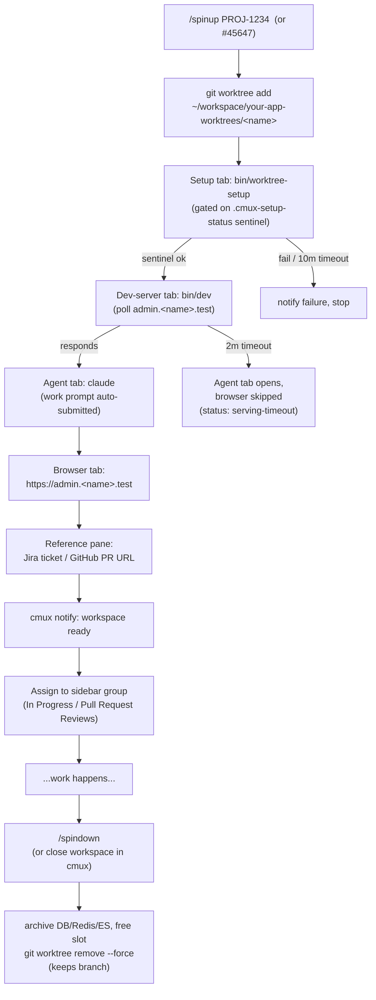

# spinup / spindown -- cmux worktree workflow

> **This is a worked example skill.** The paths, repo name, and dev-server conventions below reflect a specific Rails project setup. Treat this as a reference implementation you adapt to your own stack. Replace `your-app`, `your-org/your-app`, and `PROJ-XXXX` with your project's values, and swap `bin/worktree-setup` / `bin/dev` for whatever your project uses.

Workflow for spinning up isolated git-worktree environments per Jira ticket or PR review, each running its own Claude agent in a visible [cmux](https://github.com/manaflow-ai/cmux) tab. This directory holds the `/spinup` and `/spindown` skills plus the Python engine and launchd listeners that drive them.

## What this does

Each unit of work (a Jira ticket or a PR to review) gets:

- its own **git worktree** under `~/workspace/your-app-worktrees/<name>` (cut from the prime `~/workspace/your-app` checkout),
- a **cmux workspace** with four success-gated tabs -- setup, dev server, Claude agent (prompt auto-submitted), and a browser at `https://admin.<name>.test`,
- placement in a pinned cmux **sidebar group** for a Kanban flow,
- automatic teardown via `/spindown` (or by closing the workspace in cmux).

A background **launchd listener** auto-spins newly-assigned tickets during work hours and surfaces PR review requests as notifications.

## Flow



ASCII fallback:

```
/spinup PROJ-1234
   |
   v
git worktree add  -->  Setup tab (bin/worktree-setup, gated on sentinel)
                          |  ok                     | fail/timeout
                          v                          \--> notify + stop
                       Dev-server tab (bin/dev, poll admin.<name>.test)
                          |  up                      | 2m timeout
                          v                          \--> agent tab only
                       Agent tab (claude, prompt auto-submitted)
                          |
                          v
                       Browser tab (admin.<name>.test) + reference pane (Jira/PR)
                          |
                          v
                       cmux notify  -->  sidebar group (Kanban)
                          |
                          v
                    ...work...  -->  /spindown  -->  archive + remove worktree (keep branch)
```

## Kanban groups

Spin-ups land in pinned cmux sidebar groups and slide rightward as work progresses:

```
[In Progress] -> [In Review] -> [Approved] -> [Done]      [Pull Request Reviews]
   (auto)          (manual)       (manual)     (manual)        (PR spin-ups)
```

- Tickets -> **In Progress** (amber, `hammer.fill`)
- PR reviews -> **Pull Request Reviews** (blue, `arrow.triangle.pull`)
- In Review / Approved / Done are manual lanes for sliding work along.

## Commands

| Command | What it does |
|---|---|
| `/spinup` | List newly-assigned eligible tickets (status: Selected for Work / Triage) not yet spun up. |
| `/spinup PROJ-1234` | Spin up a Jira ticket via cmux (worktree -> 4 tabs -> In Progress). |
| `/spinup #45647` | Spin up a PR for review via cmux. |
| `/spinup --atlas PROJ-1234` | Escape hatch: use the legacy Atlas workspace path. |
| `/spindown [name]` | Tear down a worktree (no arg = focused workspace). Refuses the prime checkout. |

## Files in this directory

| File | Role |
|---|---|
| `SKILL.md` | The `/spinup` skill definition (4 modes + listener docs). |
| `scripts/cmux_chain.py` | Main engine -- worktree creation, the 4-tab chain, group assignment, `cmux-poll`, `spindown`/teardown. |
| `scripts/spinup_helper.py` | Shared helpers -- Jira fetch (`acli`), branch derivation, transition-to-In-Progress, `poll`. Also the Atlas path. |
| `scripts/test_cmux_chain.py` | Test suite for the cmux engine. |
| `scripts/test_spinup_helper.py` | Test suite for the shared helpers. |
| `scripts/cmux-poller.sh` + `inc.example.cmux-work-listener.plist` | launchd job: auto-spin tickets + surface PRs (Mon-Fri 08:00-16:00, every 20 min). |
| `scripts/cmux-close-listener.sh` + `inc.example.cmux-close-listener.plist` | launchd job: tear down a worktree when its cmux workspace is closed. |

The `../spindown/SKILL.md` skill is a thin wrapper over `cmux_chain.py spindown`.

## Branch derivation

`<prefix>/<lowered-key>[-<slug>]` where prefix is by Jira issue type:

- Story -> `feature/`
- Bug -> `bugfix/`
- everything else -> `internal/`

## Install / prerequisites

One-time:

1. Install cmux (homebrew cask). Enable external CLI control -- **off by default**. In `~/.config/cmux/cmux.json`:
   ```json
   "automation": { "socketControlMode": "automation" }
   ```
   Then fully quit and relaunch cmux (`reload-config` can't apply it). Verify with `cmux ping` -> `PONG`.
2. `acli` and `gh` installed and authenticated (`acli auth login`, `gh auth login`).
3. `~/workspace/your-app` is a valid git repo (the worktree source).
4. (Optional) auto-enable Claude Remote Control for every session: `"remoteControlAtStartup": true` in `~/.claude.json`.

To run the listeners:

```bash
# seed state so the first poll doesn't burst-spin the whole backlog
python3 ~/.claude/skills/spinup/scripts/cmux_chain.py seed-backlog

# dry-run (expect empty jira_spun_up / prs_to_surface)
python3 ~/.claude/skills/spinup/scripts/cmux_chain.py cmux-poll

# install + load
cp ~/.claude/skills/spinup/scripts/inc.example.cmux-work-listener.plist ~/Library/LaunchAgents/
cp ~/.claude/skills/spinup/scripts/inc.example.cmux-close-listener.plist ~/Library/LaunchAgents/
launchctl load ~/Library/LaunchAgents/inc.example.cmux-work-listener.plist
launchctl load ~/Library/LaunchAgents/inc.example.cmux-close-listener.plist
```

Confirm the Atlas listener is NOT also loaded (`launchctl list | grep example`) -- running both would double-spin tickets.

## Adapting to your stack

The key constants to change in `cmux_chain.py` and `spinup_helper.py`:

- `MAIN_REPO` -- path to your prime checkout
- `WORKTREE_BASE` -- where worktrees are created
- `GH_REPO` -- `your-org/your-app`
- `JIRA_BROWSE_BASE` -- `https://your-jira-instance/browse`
- Shell commands (`bin/worktree-setup`, `bin/dev`, `bin/worktree-teardown`) -- replace with your project's setup scripts
- The dev server health check URL pattern (`admin.<name>.test`) -- replace with your project's local URL scheme

## Gotchas

- **Stale base:** branches are cut from the prime checkout's local `main`. Run `git fetch origin main` and rebase early rather than at PR time.
- **Worktree slots are finite and shared** across all clones (count via `git worktree list`). Clean up orphaned worktrees regularly.
- **The prime checkout is protected** -- `/spindown` refuses to tear it down.
- **Verify dev-server state from the cmux terminal**, not curl alone -- an orphaned process squatting on the port can satisfy a curl probe.

## State files (do not edit directly)

- `~/.claude/cache/spinup-surfaced.json` -- Jira spin-up state.
- `~/.claude/cache/pr-surfaced.json` -- PR decision state.
